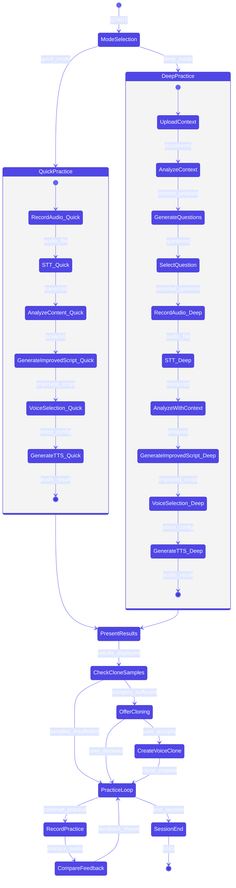
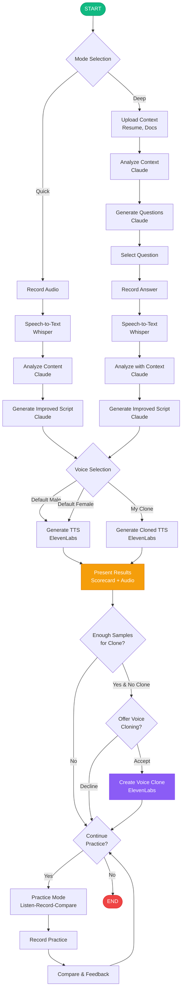

# AI Speech Coach - LangGraph Architecture

## Flow Diagram (Mermaid)



## Simplified Flow Diagram



## LangGraph Python Implementation

```python
from typing import TypedDict, Literal, Annotated, List, Optional
from langgraph.graph import StateGraph, START, END
from langgraph.checkpoint.memory import MemorySaver
import operator

# ============================================
# STATE DEFINITION
# ============================================

class SpeechCoachState(TypedDict):
    # Session info
    session_id: str
    user_id: str
    mode: Literal["quick", "deep"]

    # Context (Deep mode only)
    uploaded_documents: List[str]
    context_analysis: Optional[str]
    generated_questions: List[str]
    selected_question: Optional[str]

    # Audio processing
    audio_file_path: str
    transcript: str

    # Analysis results
    analysis_result: dict  # Contains scores, feedback, etc.
    improved_script: str

    # Voice settings
    voice_type: Literal["default_male", "default_female", "cloned"]
    voice_clone_id: Optional[str]

    # TTS output
    original_audio_url: str
    improved_audio_url: str

    # Clone sampling
    sample_count: int
    samples_sufficient: bool
    clone_offered: bool
    clone_accepted: bool

    # Practice loop
    practice_attempts: Annotated[List[dict], operator.add]
    continue_practice: bool

    # Messages for UI
    messages: Annotated[List[str], operator.add]


# ============================================
# NODE FUNCTIONS
# ============================================

def mode_selection(state: SpeechCoachState) -> dict:
    """Route based on selected mode"""
    return {"messages": [f"Mode selected: {state['mode']}"]}


def upload_context(state: SpeechCoachState) -> dict:
    """Handle document uploads (Deep mode)"""
    # TODO: Implement S3 upload, document parsing
    return {
        "messages": ["Documents uploaded successfully"],
        "uploaded_documents": state.get("uploaded_documents", [])
    }


def analyze_context(state: SpeechCoachState) -> dict:
    """Analyze uploaded documents with Claude"""
    # TODO: Call Claude API to analyze resume, project docs
    # Extract key skills, experiences, potential interview topics
    context_analysis = "Analyzed: Senior backend engineer, 5 years experience..."
    return {
        "context_analysis": context_analysis,
        "messages": ["Context analyzed"]
    }


def generate_questions(state: SpeechCoachState) -> dict:
    """Generate interview questions based on context"""
    # TODO: Call Claude API with context to generate questions
    questions = [
        "자기소개를 해주세요",
        "이 프로젝트에서 가장 어려웠던 기술적 도전은?",
        "왜 이직을 결심하셨나요?",
        "5년 후 커리어 목표는?"
    ]
    return {
        "generated_questions": questions,
        "messages": ["Questions generated based on your profile"]
    }


def record_audio(state: SpeechCoachState) -> dict:
    """Handle audio recording"""
    # Audio recording happens on frontend
    # This node receives the audio file path
    return {
        "messages": ["Audio recorded"],
        "sample_count": state.get("sample_count", 0) + 1
    }


def speech_to_text(state: SpeechCoachState) -> dict:
    """Convert audio to text using Whisper"""
    # TODO: Call OpenAI Whisper API
    transcript = "안녕하세요, 저는 5년차 백엔드 개발자입니다..."
    return {
        "transcript": transcript,
        "messages": ["Transcription complete"]
    }


def analyze_content(state: SpeechCoachState) -> dict:
    """Analyze speech content with Claude"""
    # TODO: Call Claude API for analysis
    # Analyze: STAR structure, filler words, pace, logic flow
    analysis = {
        "scores": {
            "logic_structure": "B+",
            "filler_words": "A",
            "speaking_pace": "C",
            "confidence_tone": "B",
            "content_specificity": "C+"
        },
        "filler_word_count": 5,
        "filler_word_percentage": 3.2,
        "words_per_minute": 185,
        "structure_flow": ["situation", "result", "action", "situation"],
        "improvement_suggestions": [
            "말 속도를 10% 낮추세요",
            "두괄식으로 핵심을 먼저 말하세요",
            "경험을 수치로 표현하세요"
        ]
    }
    return {
        "analysis_result": analysis,
        "messages": ["Analysis complete"]
    }


def analyze_with_context(state: SpeechCoachState) -> dict:
    """Analyze speech with uploaded context (Deep mode)"""
    # TODO: Enhanced analysis using context
    # Compare answer against uploaded documents
    # Check for consistency, depth, relevance
    analysis = analyze_content(state)["analysis_result"]
    analysis["context_relevance"] = "B+"
    analysis["depth_score"] = "B"
    return {
        "analysis_result": analysis,
        "messages": ["Context-aware analysis complete"]
    }


def generate_improved_script(state: SpeechCoachState) -> dict:
    """Generate improved version of the script"""
    # TODO: Call Claude API to rewrite script
    # Apply STAR structure, remove filler words, improve flow
    improved = """안녕하세요, 저는 5년차 백엔드 개발자 홍길동입니다.

현재 ABC 회사에서 하루 1천만 트랜잭션을 처리하는 결제 시스템을 설계하고 있습니다.

가장 큰 성과는 레거시 시스템 마이그레이션 프로젝트에서
다운타임 제로로 전환을 완료하여 연간 운영비용을 40% 절감한 것입니다."""

    return {
        "improved_script": improved,
        "messages": ["Improved script generated"]
    }


def select_voice(state: SpeechCoachState) -> dict:
    """Determine which voice to use for TTS"""
    voice_type = state.get("voice_type", "default_male")
    voice_clone_id = state.get("voice_clone_id")

    if voice_type == "cloned" and voice_clone_id:
        return {"messages": ["Using your cloned voice"]}
    else:
        return {
            "voice_type": voice_type,
            "messages": [f"Using {voice_type} voice"]
        }


def generate_tts(state: SpeechCoachState) -> dict:
    """Generate TTS audio using ElevenLabs"""
    # TODO: Call ElevenLabs API
    # Use appropriate voice (default or cloned)
    return {
        "improved_audio_url": "https://storage.example.com/improved_audio.mp3",
        "messages": ["TTS audio generated"]
    }


def present_results(state: SpeechCoachState) -> dict:
    """Prepare results for presentation"""
    return {
        "messages": [
            "Results ready",
            f"Scores: {state['analysis_result']['scores']}",
            "Improved audio available"
        ]
    }


def check_clone_samples(state: SpeechCoachState) -> dict:
    """Check if enough samples collected for voice cloning"""
    sample_count = state.get("sample_count", 0)
    # Need 30+ seconds or 3+ recordings
    samples_sufficient = sample_count >= 3

    return {
        "samples_sufficient": samples_sufficient,
        "messages": [f"Sample count: {sample_count}, Sufficient: {samples_sufficient}"]
    }


def offer_cloning(state: SpeechCoachState) -> dict:
    """Offer voice cloning to user"""
    return {
        "clone_offered": True,
        "messages": ["Voice cloning available! Would you like to create your voice clone?"]
    }


def create_voice_clone(state: SpeechCoachState) -> dict:
    """Create voice clone using ElevenLabs"""
    # TODO: Call ElevenLabs voice cloning API
    clone_id = "voice_clone_12345"
    return {
        "voice_clone_id": clone_id,
        "voice_type": "cloned",
        "messages": ["Voice clone created successfully!"]
    }


def practice_loop(state: SpeechCoachState) -> dict:
    """Handle practice mode continuation"""
    return {"messages": ["Ready for practice mode"]}


def record_practice(state: SpeechCoachState) -> dict:
    """Record practice attempt"""
    return {"messages": ["Practice recording captured"]}


def compare_feedback(state: SpeechCoachState) -> dict:
    """Compare practice with improved version"""
    # TODO: Analyze practice recording
    # Compare with improved version
    practice_result = {
        "attempt_number": len(state.get("practice_attempts", [])) + 1,
        "improvement_percentage": 15,
        "feedback": "말 속도가 개선되었습니다!"
    }
    return {
        "practice_attempts": [practice_result],
        "messages": ["Practice feedback generated"]
    }


# ============================================
# ROUTING FUNCTIONS
# ============================================

def route_by_mode(state: SpeechCoachState) -> Literal["quick_flow", "deep_flow"]:
    """Route to appropriate flow based on mode"""
    if state.get("mode") == "deep":
        return "deep_flow"
    return "quick_flow"


def route_clone_check(state: SpeechCoachState) -> Literal["offer_cloning", "practice_loop"]:
    """Check if should offer cloning"""
    if state.get("samples_sufficient") and not state.get("voice_clone_id"):
        return "offer_cloning"
    return "practice_loop"


def route_clone_decision(state: SpeechCoachState) -> Literal["create_clone", "practice_loop"]:
    """Route based on user's cloning decision"""
    if state.get("clone_accepted"):
        return "create_clone"
    return "practice_loop"


def route_practice_decision(state: SpeechCoachState) -> Literal["record_practice", "end"]:
    """Route based on practice continuation decision"""
    if state.get("continue_practice"):
        return "record_practice"
    return "end"


# ============================================
# GRAPH CONSTRUCTION
# ============================================

def build_speech_coach_graph():
    """Build the complete LangGraph"""

    graph = StateGraph(SpeechCoachState)

    # Add all nodes
    graph.add_node("mode_selection", mode_selection)

    # Quick mode nodes
    graph.add_node("record_audio_quick", record_audio)
    graph.add_node("stt_quick", speech_to_text)
    graph.add_node("analyze_quick", analyze_content)
    graph.add_node("improve_quick", generate_improved_script)
    graph.add_node("voice_quick", select_voice)
    graph.add_node("tts_quick", generate_tts)

    # Deep mode nodes
    graph.add_node("upload_context", upload_context)
    graph.add_node("analyze_context", analyze_context)
    graph.add_node("generate_questions", generate_questions)
    graph.add_node("record_audio_deep", record_audio)
    graph.add_node("stt_deep", speech_to_text)
    graph.add_node("analyze_deep", analyze_with_context)
    graph.add_node("improve_deep", generate_improved_script)
    graph.add_node("voice_deep", select_voice)
    graph.add_node("tts_deep", generate_tts)

    # Shared nodes
    graph.add_node("present_results", present_results)
    graph.add_node("check_samples", check_clone_samples)
    graph.add_node("offer_cloning", offer_cloning)
    graph.add_node("create_clone", create_voice_clone)
    graph.add_node("practice_loop", practice_loop)
    graph.add_node("record_practice", record_practice)
    graph.add_node("compare_feedback", compare_feedback)

    # Entry edge
    graph.add_edge(START, "mode_selection")

    # Mode routing
    graph.add_conditional_edges(
        "mode_selection",
        route_by_mode,
        {
            "quick_flow": "record_audio_quick",
            "deep_flow": "upload_context"
        }
    )

    # Quick mode flow
    graph.add_edge("record_audio_quick", "stt_quick")
    graph.add_edge("stt_quick", "analyze_quick")
    graph.add_edge("analyze_quick", "improve_quick")
    graph.add_edge("improve_quick", "voice_quick")
    graph.add_edge("voice_quick", "tts_quick")
    graph.add_edge("tts_quick", "present_results")

    # Deep mode flow
    graph.add_edge("upload_context", "analyze_context")
    graph.add_edge("analyze_context", "generate_questions")
    graph.add_edge("generate_questions", "record_audio_deep")
    graph.add_edge("record_audio_deep", "stt_deep")
    graph.add_edge("stt_deep", "analyze_deep")
    graph.add_edge("analyze_deep", "improve_deep")
    graph.add_edge("improve_deep", "voice_deep")
    graph.add_edge("voice_deep", "tts_deep")
    graph.add_edge("tts_deep", "present_results")

    # Results to clone check
    graph.add_edge("present_results", "check_samples")

    # Clone routing
    graph.add_conditional_edges(
        "check_samples",
        route_clone_check,
        {
            "offer_cloning": "offer_cloning",
            "practice_loop": "practice_loop"
        }
    )

    graph.add_conditional_edges(
        "offer_cloning",
        route_clone_decision,
        {
            "create_clone": "create_clone",
            "practice_loop": "practice_loop"
        }
    )

    graph.add_edge("create_clone", "practice_loop")

    # Practice loop
    graph.add_conditional_edges(
        "practice_loop",
        route_practice_decision,
        {
            "record_practice": "record_practice",
            "end": END
        }
    )

    graph.add_edge("record_practice", "compare_feedback")
    graph.add_edge("compare_feedback", "practice_loop")

    return graph


# ============================================
# COMPILE AND RUN
# ============================================

def create_speech_coach():
    """Create compiled speech coach graph with memory"""
    graph = build_speech_coach_graph()
    memory = MemorySaver()
    return graph.compile(checkpointer=memory)


# Example usage
if __name__ == "__main__":
    app = create_speech_coach()

    # Quick mode example
    initial_state = {
        "session_id": "session_001",
        "user_id": "user_001",
        "mode": "quick",
        "audio_file_path": "/tmp/recording.webm",
        "voice_type": "default_female",
        "sample_count": 0,
        "continue_practice": False,
        "messages": [],
        "practice_attempts": []
    }

    config = {"configurable": {"thread_id": "session_001"}}
    result = app.invoke(initial_state, config)
    print(result)
```

## Node Descriptions

| Node | Description | External API |
|------|-------------|--------------|
| `mode_selection` | Route to Quick or Deep mode | - |
| `upload_context` | Handle document uploads | S3 |
| `analyze_context` | Analyze uploaded docs | Claude |
| `generate_questions` | Create interview questions | Claude |
| `record_audio` | Capture user's audio | Frontend |
| `speech_to_text` | Convert audio to text | Whisper |
| `analyze_content` | Analyze speech quality | Claude |
| `generate_improved_script` | Rewrite with improvements | Claude |
| `select_voice` | Choose TTS voice | - |
| `generate_tts` | Create audio from script | ElevenLabs |
| `present_results` | Display scorecard + audio | - |
| `check_clone_samples` | Verify sample count | - |
| `offer_cloning` | Prompt for voice clone | - |
| `create_voice_clone` | Create voice clone | ElevenLabs |
| `practice_loop` | Handle practice mode | - |
| `compare_feedback` | Compare practice vs improved | Claude |

## State Flow Summary

```
START
  │
  ▼
┌─────────────────┐
│ Mode Selection  │
└────────┬────────┘
         │
    ┌────┴────┐
    ▼         ▼
 Quick      Deep
  Mode      Mode
    │         │
    │    Upload Context
    │         │
    │    Analyze Context
    │         │
    │    Generate Questions
    │         │
    ▼         ▼
 Record ◄────┘
    │
    ▼
 Whisper STT
    │
    ▼
 Claude Analysis
    │
    ▼
 Claude Improve Script
    │
    ▼
 Voice Selection
    │
    ▼
 ElevenLabs TTS
    │
    ▼
 Present Results
    │
    ▼
 Check Clone Samples ──► Offer Cloning ──► Create Clone
    │                         │                  │
    └─────────────────────────┴──────────────────┘
                              │
                              ▼
                       Practice Loop ◄──┐
                              │         │
                      ┌───────┴───────┐ │
                      ▼               ▼ │
                    END          Record Practice
                                      │
                                Compare Feedback
                                      │
                                      └─┘
```
